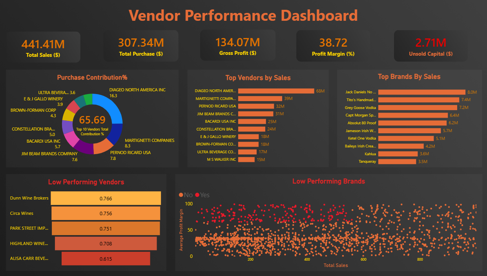

<div align="center">

# 🥃 Vendor Performance Analysis

### Turning 1Million+ raw transactions into vendor, brand & inventory intelligence


*An end-to-end data analytics project — from raw CSVs to a statistically validated, dashboard-driven business report.*

</div>

<br>

## 📊 Dashboard Preview

<div align="center">

</div>

<br>

---

## 📌 Table of Contents

- [Overview](#-overview)
- [Business Problem](#-business-problem)
- [Headline Results](#-headline-results)
- [Tech Stack](#-tech-stack)
- [Project Architecture](#-project-architecture)
- [Repository Structure](#-repository-structure)
- [About the Data](#-about-the-data)
- [Methodology](#-methodology)
- [Exploratory Data Analysis](#-exploratory-data-analysis)
- [Key Findings](#-key-findings)
- [Statistical Validation](#-statistical-validation)
- [Recommendations](#-recommendations)
- [How to Run This Project](#-how-to-run-this-project)
- [Report & Deliverables](#-report--deliverables)
- [Author](#-author)

<br>

---

## 🧭 Overview

**Vendor Performance Analysis** is a full-cycle data analytics project built for a retail & wholesale beverage distribution business. It consolidates **over 1 million transaction-level records** across purchases, sales, invoices, and pricing into a single vendor-brand performance model — then applies exploratory analysis, correlation studies, and formal hypothesis testing to answer concrete business questions:

> Which vendors and brands actually drive profit — and which ones are quietly draining it?

The project moves through the complete analytics lifecycle: **SQL-based data ingestion → data cleaning & feature engineering → exploratory analysis → statistical testing → executive reporting → interactive dashboarding.**

<br>

## 🎯 Business Problem

Effective inventory and sales management is critical to profitability in retail and wholesale. Without visibility into vendor concentration, pricing efficiency, and inventory turnover, businesses risk absorbing losses through dead stock, weak margins, and over-dependence on a handful of suppliers.

This analysis was designed to:

- 🔍 Identify **underperforming brands** that need promotional or pricing adjustments
- 🏆 Determine the **top vendors** driving sales and gross profit
- 📦 Quantify the impact of **bulk purchasing** on unit costs
- 🔄 Assess **inventory turnover** to reduce holding costs
- ⚖️ Investigate the **profitability gap** between high- and low-performing vendors

<br>

## 🏁 Headline Results

<div align="center">

| Metric | Value |
|---|---|
| 💰 Total Sales | **$441.41M** |
| 🧾 Total Purchases | **$307.34M** |
| 📈 Gross Profit | **$134.07M** |
| 📊 Overall Profit Margin | **38.72%** |
| 📦 Unsold Inventory Capital | **$2.71M** |
| 🏢 Top 10 Vendors' Purchase Share | **65.69%** |
| 💵 Unit Cost Reduction via Bulk Buying | **72%** |

</div>

<br>

## 🛠 Tech Stack

| Layer | Tools |
|---|---|
| **Language** | Python 3.13 |
| **Data Ingestion & Storage** | SQLite, SQLAlchemy |
| **Data Wrangling** | Pandas, NumPy |
| **Statistical Analysis** | SciPy (`ttest_ind`), confidence intervals, hypothesis testing |
| **Visualization** | Matplotlib, Seaborn |
| **Reporting** | PDF (analytical report) |
| **Business Dashboard** | Power BI |
| **Environment** | Jupyter Notebook |

<br>

## 🏗 Project Architecture

```
                ┌─────────────────────┐
                │   Raw CSV Sources    │
                │  (purchases, sales,  │
                │  invoices, pricing)  │
                └──────────┬───────────┘
                           │  scripts/ingestion_db.py
                           ▼
                ┌─────────────────────┐
                │   SQLite Database    │
                │    (inventory.db)    │
                └──────────┬───────────┘
                           │  scripts/get_vendor_summary.py
                           ▼
                ┌─────────────────────┐
                │ Vendor Sales Summary │
                │  (10,692 records)    │
                │  + engineered KPIs   │
                └──────────┬───────────┘
                           │
              ┌────────────┼────────────┐
              ▼            ▼             ▼
        ┌──────────┐ ┌───────────┐ ┌─────────────┐
        │   EDA    │ │Statistical│ │ Power BI    │
        │ Notebook │ │  Testing  │ │ Dashboard   │
        └──────────┘ └───────────┘ └─────────────┘
              │            │             │
              └────────────┴─────────────┘
                           ▼
                ┌─────────────────────┐
                │    PDF Report +      │
                │  Business Insights   │
                └─────────────────────┘
```

<br>

## 📁 Repository Structure

```
vendor-performance-analysis/
│
├── images/
│   └── dashboard.png                          # Power BI dashboard screenshot
│
├── logs/
│   └── ingestion_db.log                       # Ingestion run logs
│
├── notebook/
│   ├── Exploratory Data Analysis.ipynb        # EDA — distributions, outliers, correlations
│   └── Vendor Performance Analysis.ipynb      # Core analysis — hypothesis testing & KPIs
│
├── powerbi/
│   └── Vendor Performance Dashboard.pbix      # Editable Power BI dashboard file
│
├── scripts/
│   ├── get_vendor_summary.py                  # Builds & cleans the vendor-brand summary table
│   └── ingestion_db.py                        # Loads raw CSVs into SQLite (chunked)
│
├── README.md
└── Vendor Performance Analysis - Report.pdf   # Full written business report
```

> ⚠️ **Note on file paths:** This repo uses spaces in several file and folder names (e.g. `Vendor Performance Analysis - Report.pdf`). GitHub's file browser handles this fine, but links inside `README.md` must URL-encode spaces as `%20`, or they will 404. All links below are already encoded correctly — see [Report & Deliverables](#-report--deliverables).

<br>

## 🗃 About the Data

The analysis draws on a vendor sales and purchase summary consolidated from **four underlying sources**:

| Source | Description |
|---|---|
| `purchases` | Product-level purchase transactions by vendor (quantity, dollars) |
| `vendor_invoice` | Aggregated freight and purchase-order data per vendor |
| `purchase_prices` | Actual vs. purchase pricing per product |
| `sales` | Sales quantity, price, revenue, and excise tax by vendor & brand |

These four tables were joined and pre-aggregated with SQL into a single **vendor-brand-level summary** (`vendor_sales_summary`), engineered with derived KPIs:

- **Gross Profit** = Total Sales − Total Purchase
- **Profit Margin** = (Gross Profit ÷ Total Sales) × 100
- **Stock Turnover** = Total Sales Quantity ÷ Total Purchase Quantity
- **Sales-to-Purchase Ratio** = Total Sales Dollars ÷ Total Purchase Dollars

<br>

## 🔬 Methodology

1. **Ingestion** — Raw CSVs (including a 12.8M-row sales table) loaded into SQLite in chunks of 100,000 rows for memory efficiency.
2. **Aggregation** — Purchase, sales, and freight tables joined via CTEs into a **10,692-row** vendor-brand summary.
3. **Cleaning** — Type correction, whitespace stripping, null handling, and derived KPI creation.
4. **Exploratory Data Analysis** — Distribution profiling, outlier detection, and correlation analysis across all key metrics.
5. **Filtering** — Removed records with Gross Profit ≤ 0, Profit Margin ≤ 0, or Total Sales Quantity = 0 to isolate genuine, profitable activity.
6. **Statistical Testing** — Confidence intervals and an independent two-sample t-test to validate profitability differences between vendor tiers.
7. **Reporting** — Findings compiled into a PDF business report and an interactive Power BI dashboard.

<br>

## 🔎 Exploratory Data Analysis

**Notable outliers & data quality flags:**

| Metric | Observation |
|---|---|
| Gross Profit | Minimum of **-$52,002.78** — evidence of loss-making sales below cost |
| Profit Margin | Extreme negative values where revenue ≈ 0 or below cost |
| Sales Quantity | Multiple products purchased but **never sold** (dead stock) |
| Purchase / Actual Price | Max values (**$5,681.81** / **$7,499.99**) far above the mean — premium product lines |
| Freight Cost | Ranges from **$0.09 to $257,032.07** — signals shipping/logistics inefficiency |
| Stock Turnover | Ranges from **0 to 274.5** — from dead stock to hyper-fast-moving items |

**Correlation highlights:**

| Relationship | Correlation | Interpretation |
|---|---|---|
| Purchase Price vs. Sales Dollars / Gross Profit | −0.012 / −0.016 | Price has negligible effect on revenue or profit |
| Purchase Quantity vs. Sales Quantity | **+0.999** | Highly efficient inventory turnover |
| Profit Margin vs. Sales Price | −0.179 | Higher prices may compress margins under competitive pressure |
| Stock Turnover vs. Gross Profit / Margin | −0.038 / −0.055 | Faster turnover doesn't guarantee higher profitability |

<br>

## 💡 Key Findings

### 1️⃣ Brands Needing Promotional or Pricing Adjustments
**198 brands** show low sales but high profit margins — strong candidates for targeted marketing or price optimization to unlock volume without hurting margin.

### 2️⃣ Vendor Concentration Risk
The **top 10 vendors contribute 65.69%** of total purchases (led by **Diageo North America Inc**), leaving the remaining vendors at just 34.31%. This concentration creates real supply-chain risk.

<div align="center">

| Top Vendors by Sales | Top Brands by Sales |
|---|---|
| Diageo North America Inc — $68M | Jack Daniels No. 7 — $8.0M |
| Martignetti Companies — $39M | Tito's Handmade Vodka — $7.4M |
| Pernod Ricard USA — $32M | Grey Goose Vodka — $7.2M |
| Jim Beam Brands Company — $31M | Capt Morgan Spiced — $6.4M |
| Bacardi USA Inc — $25M | Absolut 80 Proof — $6.2M |

</div>

### 3️⃣ Bulk Purchasing Advantage
Vendors buying in bulk achieve a **72% lower unit cost** (**$10.78/unit** vs. significantly higher costs on smaller orders) — a strong lever for margin protection.

### 4️⃣ Inventory Turnover Risk
**$2.71M in unsold inventory capital** is currently tied up. The lowest-turnover vendors:

| Vendor | Stock Turnover |
|---|---|
| Dunn Wine Brokers | 0.766 |
| Circa Wines | 0.756 |
| Park Street Imports | 0.751 |
| Highland Wine Merchants | 0.708 |
| Alisa Carr Beverages | 0.615 |

### 5️⃣ Margin Gap: Top vs. Low-Performing Vendors
| Vendor Group | 95% Confidence Interval | Mean Margin |
|---|---|---|
| Top Vendors | (30.74%, 31.61%) | **31.17%** |
| Low-Performing Vendors | (40.48%, 42.62%) | **41.55%** |

Counter-intuitively, **low-performing vendors carry higher margins but lower volume** — suggesting a pricing or market-reach problem rather than a cost problem.

<br>

## 📐 Statistical Validation

A two-sample **t-test** (`scipy.stats.ttest_ind`) was used to confirm whether the margin gap above is statistically meaningful:

> **H₀:** No significant difference in profit margins between top and low-performing vendors
> **H₁:** A significant difference exists between the two groups

**Result:** ❌ Null hypothesis rejected — the two vendor groups operate under **distinctly different profitability models**, confirming the finding is not due to random variation.

<br>

## ✅ Recommendations

- 🎯 **Re-price low-sales, high-margin brands** to drive volume without sacrificing profitability
- 🤝 **Diversify vendor partnerships** to reduce dependency on a small supplier base
- 📦 **Leverage bulk purchasing** to sustain competitive pricing while optimizing inventory
- 🧹 **Clear slow-moving inventory** via revised order quantities or clearance strategies
- 📣 **Boost marketing & distribution** for low-performing (but high-margin) vendors

<br>

## ▶️ How to Run This Project

```bash
# 1. Clone the repository
git clone https://github.com/<your-username>/vendor-performance-analysis.git
cd vendor-performance-analysis

# 2. Install dependencies
pip install pandas numpy scipy matplotlib seaborn sqlalchemy jupyter

# 3. Add your raw CSVs to a /data folder, then run ingestion
python scripts/ingestion_db.py

# 4. Build the vendor-brand summary table
python scripts/get_vendor_summary.py

# 5. Explore the analysis notebooks
jupyter notebook "notebook/Exploratory Data Analysis.ipynb"
jupyter notebook "notebook/Vendor Performance Analysis.ipynb"

# 6. Open the dashboard
#    Requires Power BI Desktop (Windows) to open the .pbix file
```

<br>

## 📑 Report & Deliverables

- 📘 **[Vendor Performance Analysis Report (PDF)](./Vendor%20Performance%20Analysis%20-%20Report.pdf)** — full written analysis with all figures and tables
- 📓 **Notebooks** — [EDA](./notebook/Exploratory%20Data%20Analysis.ipynb) and [Statistical Analysis](./notebook/Vendor%20Performance%20Analysis.ipynb), fully reproducible
- 📊 **[Power BI Dashboard file](./powerbi/Vendor%20Performance%20Dashboard.pbix)** — open with Power BI Desktop for live, interactive drill-down
- 🖼 **[Dashboard screenshot](./images/dashboard.png)** — static preview, shown at the top of this README

<br>

---

<div align="center">

## 👤 Author

**Vikram Kumar**
Data Analyst | Python · SQL · Power BI

<a href="#"></a>
<a href="#"></a>

⭐ If you found this project useful, consider giving it a star!

</div>
